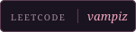
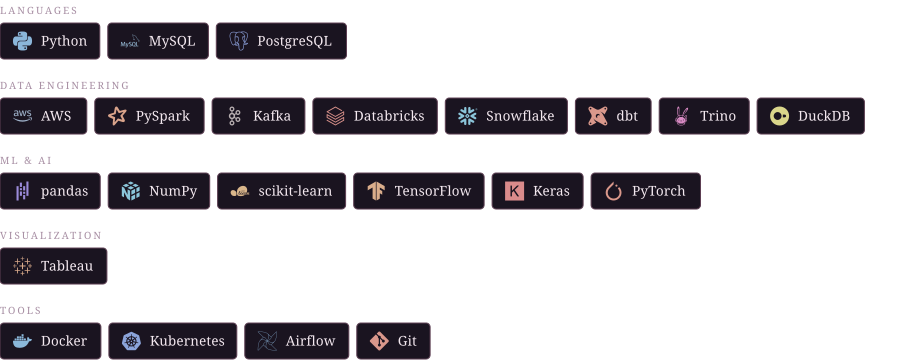

  <picture>
    <source media="(prefers-color-scheme: dark)" srcset="assets/header-dark.svg">
    <source media="(prefers-color-scheme: light)" srcset="assets/header-light.svg">
    
  </picture>

  <picture><source media="(prefers-color-scheme: dark)" srcset="assets/badge-website-dark.svg"><source media="(prefers-color-scheme: light)" srcset="assets/badge-website-light.svg"></picture>
  <a href="https://linkedin.com/in/deepthidubasi"><picture><source media="(prefers-color-scheme: dark)" srcset="assets/badge-linkedin-dark.svg"><source media="(prefers-color-scheme: light)" srcset="assets/badge-linkedin-light.svg"></picture></a>
  <a href="https://substack.com/@deepthidubasi"><picture><source media="(prefers-color-scheme: dark)" srcset="assets/badge-blog-dark.svg"><source media="(prefers-color-scheme: light)" srcset="assets/badge-blog-light.svg"></picture></a>
  <a href="https://leetcode.com/u/vampiz/"><picture><source media="(prefers-color-scheme: dark)" srcset="assets/badge-leetcode-dark.svg"><source media="(prefers-color-scheme: light)" srcset="assets/badge-leetcode-light.svg"></picture></a>
  <a href="mailto:deepthid411@gmail.com"><picture><source media="(prefers-color-scheme: dark)" srcset="assets/badge-email-dark.svg"><source media="(prefers-color-scheme: light)" srcset="assets/badge-email-light.svg"></picture></a>

<picture><source media="(prefers-color-scheme: dark)" srcset="assets/head-hi-there-dark.svg"><source media="(prefers-color-scheme: light)" srcset="assets/head-hi-there-light.svg"></picture>

My name is Deepthi Dubasi, currently working as a Data Engineer at a startup called Cuedo Analytics. I graduated in B.Tech Computer Science from VIT Vellore (2025). 

My interests lie within the field of Data and AI, much in building a pipeline or even an app that helps solve an issue (and pays for my food). 

Outside my academic and professional pursuits, I am passionate about reading books, spotify, football and adding more hobbies to this list.

<picture><source media="(prefers-color-scheme: dark)" srcset="assets/head-tools-dark.svg"><source media="(prefers-color-scheme: light)" srcset="assets/head-tools-light.svg"></picture>

<picture><source media="(prefers-color-scheme: dark)" srcset="assets/tools-dark.svg"><source media="(prefers-color-scheme: light)" srcset="assets/tools-light.svg"></picture>

**On AWS:** S3 · Athena · Glue · Redshift · EMR · EKS · EC2 · Kinesis · Lambda · DynamoDB · Bedrock · SageMaker · CloudFormation · Iceberg

<picture><source media="(prefers-color-scheme: dark)" srcset="assets/head-focus-dark.svg"><source media="(prefers-color-scheme: light)" srcset="assets/head-focus-light.svg"></picture>

- SQL Mastery
- Data Engineering Fundamentals
- Apache Spark
- System Design

<picture><source media="(prefers-color-scheme: dark)" srcset="assets/head-featured-dark.svg"><source media="(prefers-color-scheme: light)" srcset="assets/head-featured-light.svg"></picture>

- **Automated Waste Segregation System** — patent registered under VIT's IPR&T Cell
- **SQL Interview Prep**
- **Data Engineering Notes**
- **Spark Learning**

<picture><source media="(prefers-color-scheme: dark)" srcset="assets/head-connect-dark.svg"><source media="(prefers-color-scheme: light)" srcset="assets/head-connect-light.svg"></picture>

LinkedIn: [linkedin.com/in/deepthidubasi](https://linkedin.com/in/deepthidubasi)
